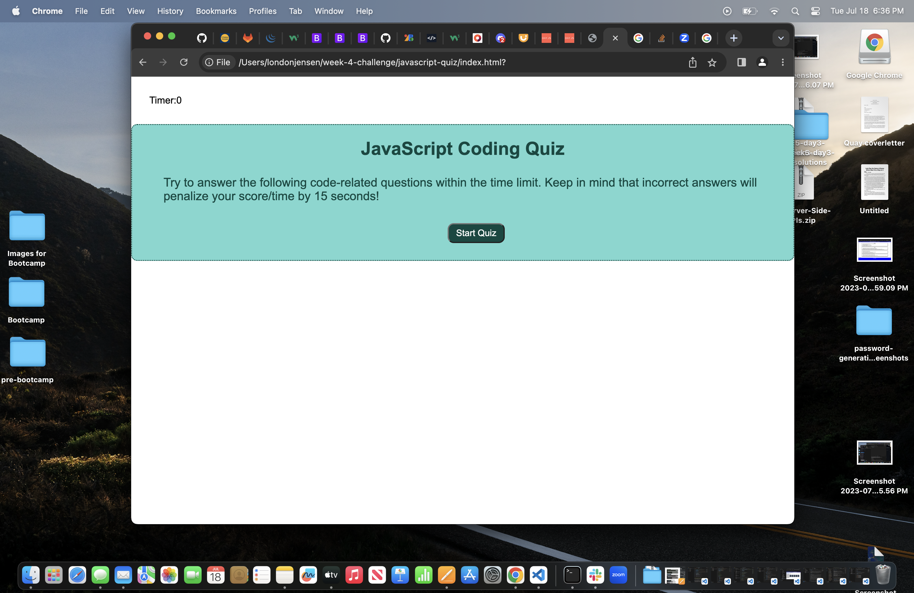
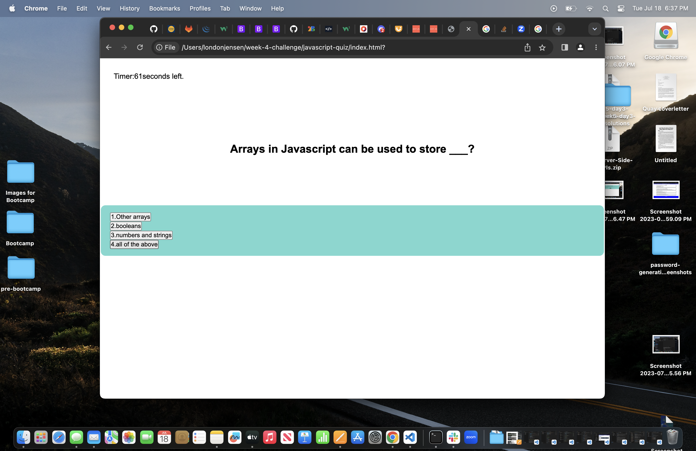
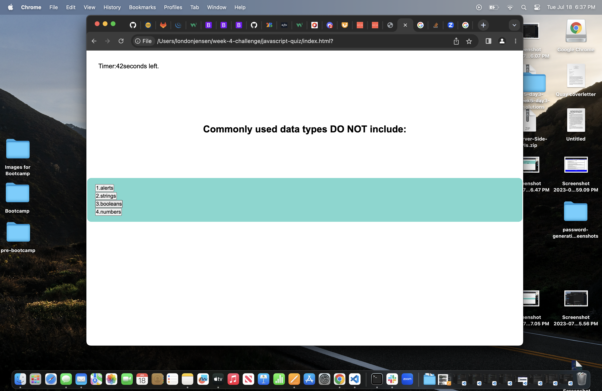
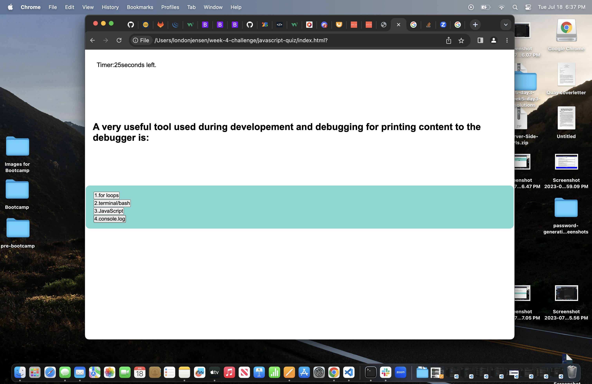
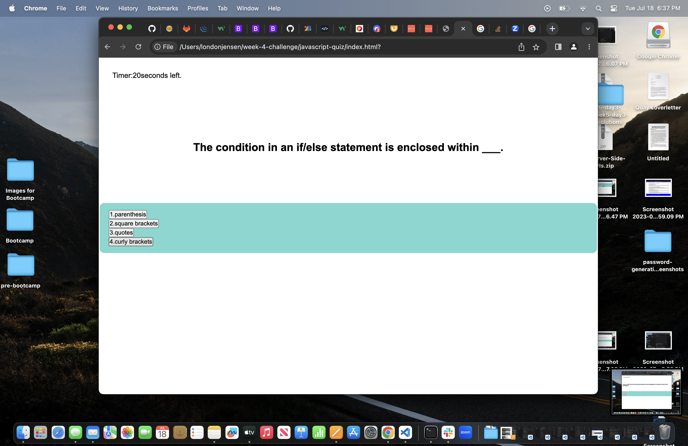
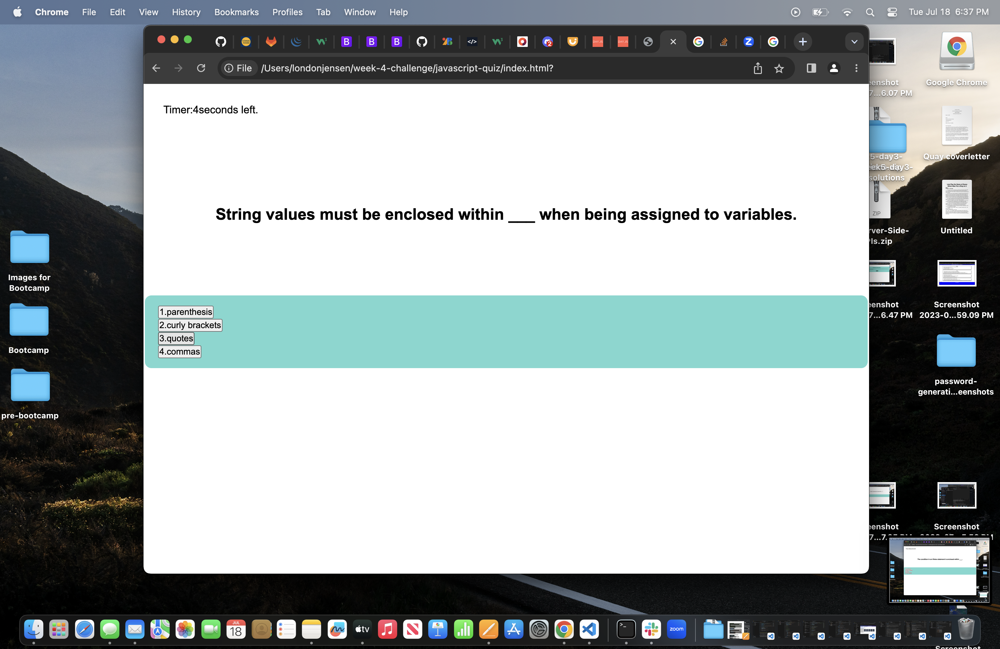
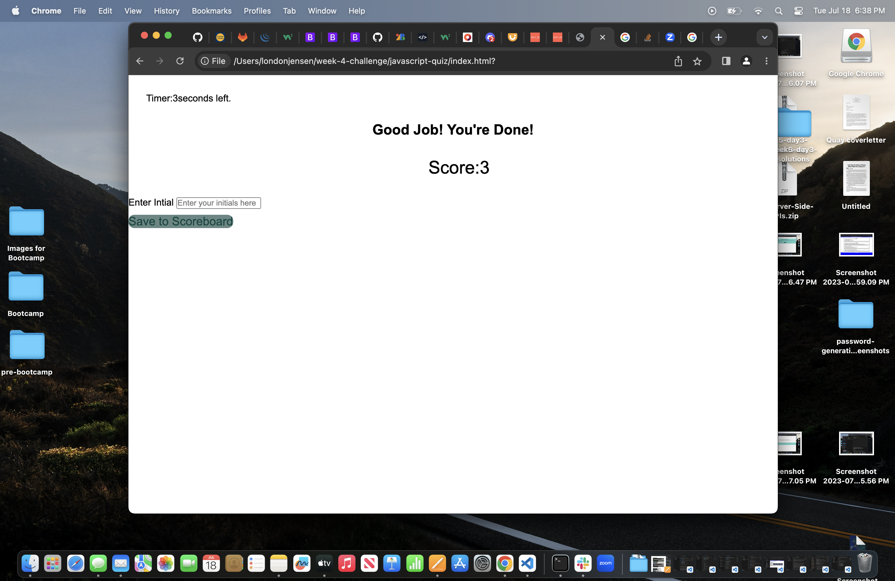
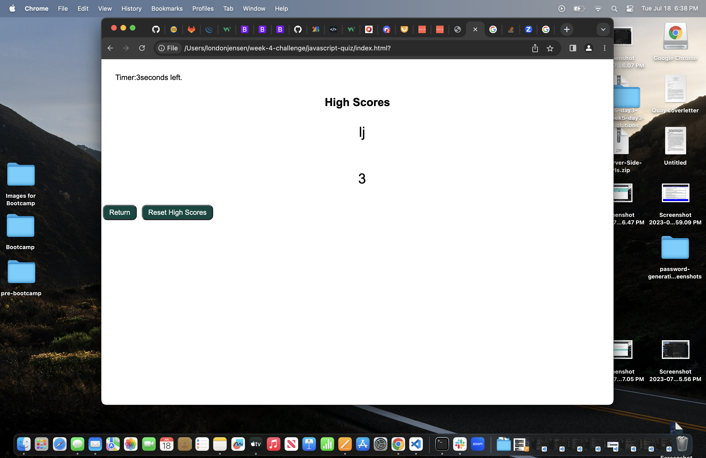

# javascript-quiz

## Description

- My motivation for building this was wanting to use my JavaScript skills that I have been learning this past week and apply it to this webpage. I wanted to have a better grasp on how to use HTML, CSS, and JavaScript.
- I built this webpage so that the user can test their JavaScript skills in a fun way by taking a timed quiz that keeps track of high scores. 
- This gives users a chance to test their own knowledge about JavaScript.
- I learned how to apply JavaScript to my HTML file and CSS file. I learned how Web API's work.

## Installation

- I created my GitHub repo named "javascript-quiz".
- I started with building my HTML file. This contains my appropriate classes and ID's, as well as the "Start Quiz", "Save", "Reset", and "Return" button.
- I created my CSS file next. This includes the styling of my webpage.
- Lastly, I worked on the JavaScript file. This is where I made the quiz function properly.
- In the JS file I added my variables that were needed to put into my functions and methods. 
- The JS file contains the questions that were asked in the quiz. It also has the array of choices the user can pick from. As well as the correct answer.
- I added my variables for the timer in the JS file. Then, I created a function for the timer. It counts down from 75 seconds.
- I created a function called 'currentQuestions' that shows the user the current question. This function contains a for loop to display the question on the screen.
- I created a 'response' function. This is where I include if statements for if the user answers the question correctly, the time continues as normal. However if they answer incorrectly, 10 seconds will be deducted from the timer. This function also includes that if the timer reaches 0 seconds, the quiz will end.
- I created a funciton for 'quizOver' that takes the user to the last page where they will be able to view their final score.
- I added an eventListener for the save button so that the users score will be saved to the leaderboard. I also included some functions to save their scores.

## Usage

- When the user is on the first page they are presented with a paragraph explaining what the quiz is. The timer is shown in the top left corner at 0. They can select the button "Start Quiz"
- Once the button is clicked, the quiz will begin. They will go through a series of 5 questions about JavaScript, with 75 seconds to complete the quiz.
- The final page shows the user their final score. They are asked to enter their initials, so that their score can be added to the leaderboard.

## License

MIT license

## Direct Link to Deployed Site

[link](https://lonj214.github.io/javascript-quiz/)

## Deployment
The application is deployed at live URL
The application is loading with no errors

## Screenshots

